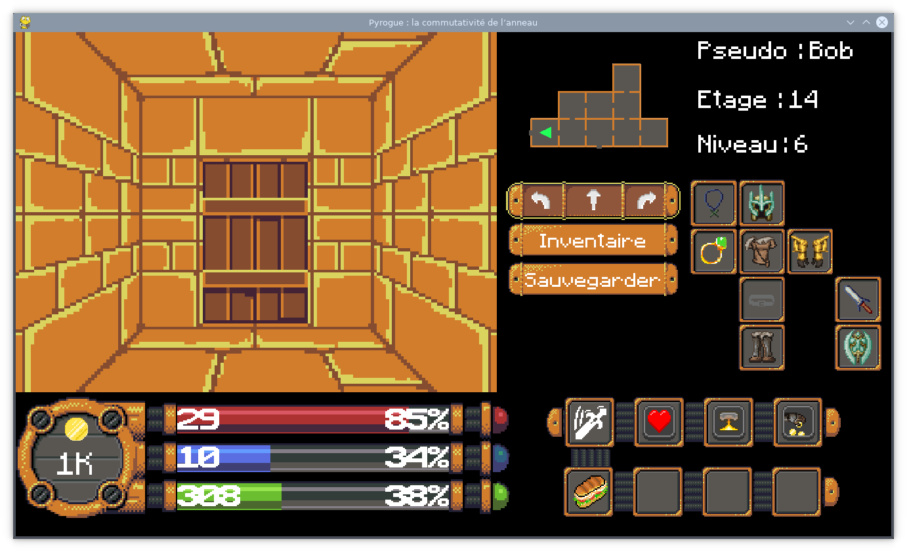

# Pyrogue
Python dev rogue project


## Dependancies 
```
pygame
matplotlib
numpy
pymongo
json
```


## How to run 
Change the working directory to the Pyrogue folder and set the main.py as the script to run 


## How to play

### Useful keys


The majority of the game do not use any extra key except when you have to write your name

### On the menu 


Use   and    to navigate and choose your option 

You may press enter to load your stats or achievement after reopening the game

### In Game



Use   and    to navigate and choose your option

In the inventory you can use your arrows to navigate between all elements and choose them with  


### With a merchant


Use   and    to navigate and choose your option 

### On fight


In the inventory you can use your arrows to navigate between all elements and choose them with  

The sandwich need to be equipped before the fight in the inventory like the spells


## Save & Load 

The save and load is done remotely 

Be sure to have  a connection opened to the mongoDB port 27017

Fight are auto-saved for data treatment anonymously 

But saves can't be totally anonymous so we only save your mac address as a signature 

